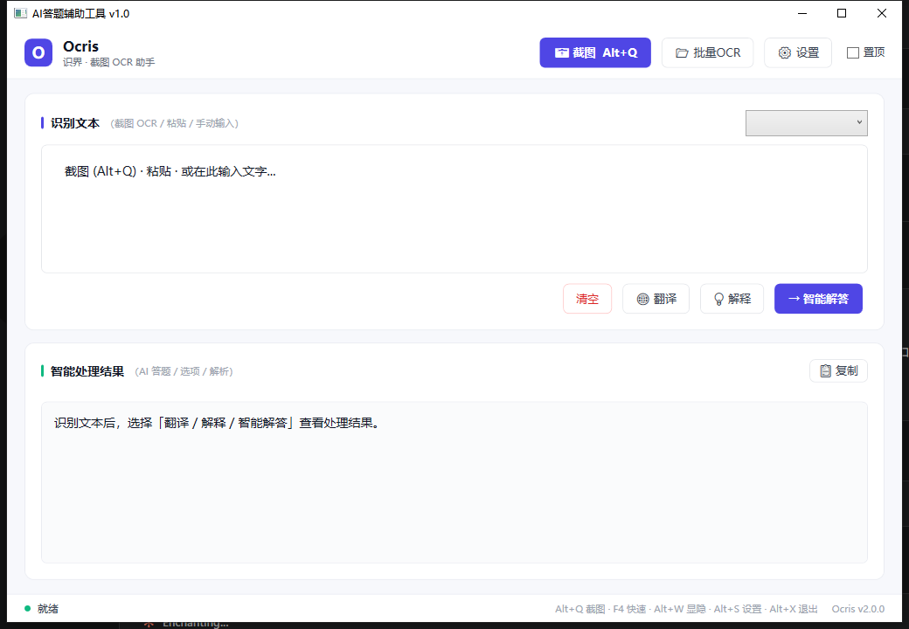

# Ocris · 识界

> 一款开源的截图 OCR 智能助手 —— **截图即识别，识别内容可被多种智能动作处理**（答题 / 翻译 / 解释）。

Ocris 取自拉丁语 *ocris*（山峰、锐顶），寓意锐利捕捉每一个字符；前三个字母 OCR 恰好呼应技术内核。

## ✨ 功能特性

- 🖼️ **智能截图** — 自研轻量引擎（GDI `BitBlt` + UI Automation 窗口/控件智能识别），区域选择、多屏、高 DPI 适配
- 🔍 **OCR 识别** — 基于 PaddleOCR 的离线识别，段落重排、批量图片识别
- 🤖 **智能动作** — AI 答题 / 🌐 翻译 / 💡 解释 / 📋 复制（OCR 结果可走不同处理，AI 是可插拔动作而非唯一目的）
- ⌨️ **全局快捷键** — 可配置，Win32 真冲突检测，改后免重启
- 🎨 **明暗主题** — Light / Dark 即时切换 + 持久化
- 🔒 **离线优先** — OCR 本地运行，识别内容不外传；仅 AI 处理走你配置的 API

## 📸 截图预览

### 主界面



识别文本（上）+ 智能处理结果（下），支持明 / 暗主题切换、批量 OCR、翻译 / 解释 / 智能解答。

### 截图选区（UIA 窗口智能识别）

按 **Alt+Q** 进入截图模式 —— 鼠标悬停在窗口/控件上会**自动高亮边界**（基于 UI Automation），拖拽选区，确认后自动 OCR。

## 🚀 快速开始

### 运行要求

- Windows 10/11（x64）
- .NET Framework 4.8 运行时（运行）/ SDK 或 Visual Studio 2019+（构建）
- Microsoft Visual C++ 2015-2022 Redistributable (x64)（PaddleOCR 原生依赖）
- PaddleOCR 推理模型（见下方）

### 构建

```powershell
# 方式一：构建脚本（推荐）
.\build.ps1

# 方式二：MSBuild（项目位于 src/Ocris/）
MSBuild src\Ocris\Ocris.csproj /p:Configuration=Release /p:Platform=x64

# 方式三：Visual Studio 2019+
#   打开 src\Ocris\Ocris.csproj → 选 Release / x64 → Ctrl+Shift+B
```

输出：`src\Ocris\bin\Release\Ocris.exe`

### OCR 模型

首次运行需要 PaddleOCR 推理模型（仓库不入库，避免体积过大）：

1. 从 [PP-OCR 系列模型列表](https://paddlepaddle.github.io/PaddleOCR/main/version2.x/ppocr/model_list.html) 下载 PP-OCRv4 推理模型（det / cls / rec）+ 字典 `ppocr_keys.txt`
2. 放到 `src\Ocris\bin\<配置>\inference\`（如 `src\Ocris\bin\Debug\inference\`），结构：
   ```
   src/Ocris/bin/Debug/inference/
   ├── ch_PP-OCRv4_det_infer/
   ├── ch_ppocr_mobile_v2.0_cls_infer/
   ├── ch_PP-OCRv4_rec_infer/
   └── ppocr_keys.txt
   ```
3. 运行 `Ocris.exe`

> 也直接从 [GitHub Release](https://github.com/Ocris-App/Ocris/releases) 下载预编译包（含模型，下载即用）。

### 配置

1. 复制 `config.example.json` 为 `config.json`
2. 填入 AI 配置（默认阿里云 DashScope，兼容 OpenAI 协议）：
   ```json
   {
     "AliCloudApiKey": "你的 API Key",
     "AliCloudApiBaseUrl": "https://dashscope.aliyuncs.com/compatible-mode/v1"
   }
   ```
3. 运行 `Ocris.exe`

> ⚠️ `config.json` 含密钥，已在 `.gitignore`，请勿提交。首次运行若不存在会自动生成默认配置。

## ⌨️ 快捷键

| 快捷键 | 功能 |
|--------|------|
| **Alt+Q** | 截图识别（UIA 智能识别窗口/控件） |
| **F4** | 快速识别（对锁定区域重复 OCR） |
| **Alt+C** | 清空内容 |
| **Alt+W** | 显示/隐藏主窗口 |
| **Alt+S** | 打开设置 |
| **Alt+X** | 退出 |

在 `config.json` 的 `Hotkeys` 段自定义，保存后即时生效。

## 🛠️ 技术栈

| 层 | 技术 |
|----|------|
| UI | WPF + MVVM（.NET Framework 4.8） |
| 截图 | GDI BitBlt + UI Automation（自研，去第三方截图库依赖） |
| OCR | PaddleOCR（离线） |
| AI | 阿里云 DashScope / OpenAI 兼容协议 |
| 热键 | NHotkey + Win32 RegisterHotKey |
| IoC | 自实现轻量 ServiceContainer |

## 📁 项目结构

```
Ocris/
├── src/Ocris/              项目源码
│   ├── App.xaml / .cs      应用入口
│   ├── Ocris.csproj        项目文件
│   ├── Models/             数据模型
│   ├── Services/           服务层（截图/OCR/AI/配置/热键/主题/窗口检测）
│   ├── ViewModels/         MVVM 视图模型
│   ├── Views/              WPF 窗口（主/截图/设置）
│   ├── Styles/ Utils/      样式与工具
│   └── Properties/ Tests/  属性与测试
├── lib/                    第三方 DLL
├── docs/                   设计文档 + 截图（DESIGN.md）
├── .github/workflows/      CI
├── README/LICENSE/CHANGELOG/CONTRIBUTING/.editorconfig
├── build.ps1               构建脚本
└── config.example.json     配置模板
```

## 🎯 设计理念

Ocris 以**截图 + OCR 为核心卖点**，AI 是"可插拔动作"之一而非唯一目的。架构上：

- **动作路由**：OCR 结果可路由到答题 / 翻译 / 解释 / 复制等动作
- **引擎可替换**：截图、OCR、AI 均接口抽象（详见 [`docs/DESIGN.md`](docs/DESIGN.md)）

## 🤝 贡献

欢迎 Issue 反馈、PR 贡献！详见 [CONTRIBUTING.md](CONTRIBUTING.md)。

- **流程**：Fork → 新分支（`feat/xxx`）→ Pull Request
- **代码约定**：C# 5 兼容（禁用 C#6+ 语法，详见 CONTRIBUTING）、遵循 `.editorconfig`、MVVM + ServiceContainer 架构
- **提交信息**：`类型: 描述`（`feat` / `fix` / `refactor` / `docs` / `chore`）
- **开发前**：建议阅读 [`docs/DESIGN.md`](docs/DESIGN.md) 了解设计理念

## 🤝 社区认可

本项目积极参与并认可 [LINUX DO](https://linux.do) 社区 —— 一个友善的技术人聚集地。

## 📄 许可证

[MIT License](LICENSE) · Copyright (c) 2026 Ocris Contributors
